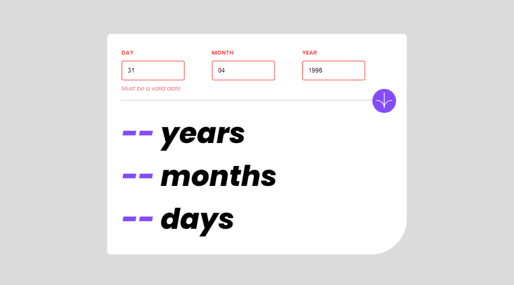
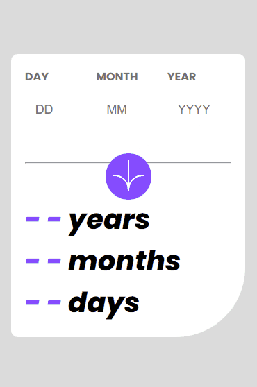

# Desafio Calculadora de Idade - Frontend-Mentor

Este é um desafio de uma calculadora de idade, proposto pelo site Frontend-Mentor.

## Tabela de Conteúdos

- [Visão Geral](#visão-geral)
    - [Imagens](#imagens)
    - [Link da página](#link)
- [Processo](#processo)
    - [Linguagens utilizadas](#linguagens-utilizadas)
    - [O que aprendi](#o-que-aprendi)
    - [Possíveis evoluções](#possíveis-evoluções)
- [Autor](#autor)

## Visão-geral

### Imagens

<br>

````
Versão de Desktop
````

   

<br>

````
Versão Mobile

````

 

### Link

- Página no GitHub Pages: <a href="https://julio-mansan2.github.io/calculadora-de-idade/">Clique aqui!</a>

## Processo

### Linguagens utilizadas

<br>

- Marcações semânticas de HTML5
- Propriedades de customização do CSS3
- Estruturas de JavaScript

<br>

### O que aprendi

<br>

- Adicionar elementos ao HTML com JavaScript:

````javascript

const dayValue = document.querySelector('.day-value')
const monthValue = document.querySelector('.month-value')
const monthInput = document.querySelector('#month-input')


if (currentMonth >= monthInput.value) {
        monthValue.innerHTML = currentMonth - monthInput.value
    } else {
        yearValue.value--;
        monthValue.innerHTML = 12 + currentMonth - monthInput.value
    }

````

- Selecionar a data atual:

````javascript

const date = new Date();
const currentYear = date.getFullYear();
const today = date.getDate();
const currentMonth = date.getMonth() + 1;

````
<br>

### Possíveis evoluções

<br>

- Códigos mais compactos;
- Posicionar melhor os elementos utilizando 'position:absolute';
- Trabalhar melhor com datas, pois ainda existem alguns problemas na calculadora, envolvendo o mês incorreto em alguns casos.

<br>

## Autor

GitHub - <a href="https://github.com/julio-mansan2">julio-mansan2</a> <br>
Front-end Mentor - <a href="https://www.frontendmentor.io/profile/julio-mansan2">julio-mansan2</a> <br>
LinkedIn - <a href="https://www.linkedin.com/in/j%C3%BAlio-a-mansan-3415a7249/">Júlio A.</a> <br>